# Durion-Moqui-Frontend Agent Structure Design

## Overview

The Durion-Moqui-Frontend Agent Structure System is a comprehensive framework that provides specialized AI agents for Moqui Framework development, Vue.js 3 frontend implementation, testing, deployment, and operations. The system is designed to support the Durion Enterprise Tire Service Management System (DETSMS) with five primary business domains—Work Execution, Inventory Control, Product & Pricing, CRM, and Accounting—providing domain-specific guidance while maintaining consistency across all components.

The agent structure provides specialized AI assistants that support the unique characteristics of Moqui Framework development (entities, services, screens, transitions) and Vue.js 3 Composition API patterns while ensuring proper integration with durion-positivity-backend service APIs through the durion-positivity integration component.

The design follows a modular, extensible architecture that allows for easy addition of new agents while ensuring seamless collaboration between existing agents. The system emphasizes practical guidance delivery, performance optimization, and production-ready patterns for enterprise Moqui applications with modern frontend integration.

## Architecture

### High-Level Architecture

```mermaid
graph TB
    subgraph "Agent Framework Core"
        AR[Agent Registry]
        AM[Agent Manager]
        CC[Collaboration Controller]
        CM[Context Manager]
    end
    
    subgraph "Foundation Agents"
        MFA[Moqui Framework Agent]
        AA[Architecture Agent]
        VUE[Vue.js Agent]
    end
    
    subgraph "Implementation Agents"
        DA[Domain Agent]
        ELA[Experience Layer Agent]
        FE[Frontend Agent]
    end
    
    subgraph "Infrastructure Agents"
        SA[Security Agent]
        DEVOPS[DevOps Agent]
        DB[Database Agent]
    end
    
    subgraph "Quality Assurance Agents"
        TA[Testing Agent]
        PERF[Performance Agent]
        PAIR[Pair Navigator Agent]
    end
    
    subgraph "Support Agents"
        DOC[Documentation Agent]
        INT[Integration Agent]
        API[API Contract Agent]
    end
    
    subgraph "External Integrations"
        POS[Positivity Backend]
        DOCKER[Docker]
        PSQL[PostgreSQL/MySQL]
        MON[Monitoring Tools]
    end
    
    AR --> AM
    AM --> CC
    CC --> CM
    
    AM --> MFA
    AM --> AA
    AM --> VUE
    AM --> DA
    AM --> ELA
    AM --> FE
    AM --> SA
    AM --> DEVOPS
    AM --> DB
    AM --> TA
    AM --> PERF
    AM --> PAIR
    AM --> DOC
    AM --> INT
    AM --> API
    
    MFA --> POS
    ELA --> POS
    DEVOPS --> DOCKER
    DB --> PSQL
    PERF --> MON
```



### Layered Architecture

The system follows a layered architecture organized into six specialized tiers:

1. **Agent Framework Core**: Registry, manager, collaboration controller, context manager
2. **Foundation Layer**: Moqui Framework, Architecture, and Vue.js expertise
3. **Implementation Layer**: Domain, Experience Layer, and Frontend implementation
4. **Infrastructure Layer**: Security, DevOps, and Database management
5. **Quality Assurance Layer**: Testing, Performance, and Pair Programming
6. **Support Layer**: Documentation, Integration, and API Contract management

### Agent Collaboration Model

Agents operate in three collaboration modes:

1. **Independent Mode**: Single agent provides specialized guidance
2. **Collaborative Mode**: Multiple agents work together on complex tasks
3. **Pair Programming Mode**: Primary agent paired with navigator for quality assurance

## Components and Interfaces

### Core Framework Components

#### Agent Registry
- **Purpose**: Central registry for all available agents
- **Responsibilities**:
  - Agent discovery and registration
  - Capability mapping and routing
  - Agent lifecycle management
  - Health monitoring and failover

#### Agent Manager
- **Purpose**: Orchestrates agent interactions and resource allocation
- **Responsibilities**:
  - Request routing and load balancing
  - Agent instantiation and pooling
  - Performance monitoring and optimization
  - Error handling and recovery

#### Collaboration Controller
- **Purpose**: Manages multi-agent collaboration and conflict resolution
- **Responsibilities**:
  - Collaboration workflow orchestration
  - Conflict detection and resolution
  - Consensus building and decision making
  - Quality assurance coordination

#### Context Manager
- **Purpose**: Maintains context across agent interactions
- **Responsibilities**:
  - Session context storage and retrieval
  - Context sharing between agents
  - Context validation and integrity
  - Temporary context cleanup

### Agent Interface Specifications

#### Base Agent Interface

```groovy
interface Agent {
    String getAgentId()
    String getAgentName()
    Set<String> getCapabilities()
    AgentResponse processRequest(AgentRequest request)
    boolean canHandle(AgentRequest request)
    AgentHealth getHealth()
}
```

#### Specialized Agent Interfaces

```groovy
interface MoquiFrameworkAgent extends Agent {
    EntityGuidance provideEntityGuidance(EntityContext context)
    ServiceGuidance provideServiceGuidance(ServiceContext context)
    ScreenGuidance provideScreenGuidance(ScreenContext context)
    IntegrationGuidance providePositivityIntegration(IntegrationContext context)
}

interface VueAgent extends Agent {
    ComponentGuidance provideComponentGuidance(ComponentContext context)
    CompositionAPIGuidance provideCompositionGuidance(CompositionContext context)
    StateManagementGuidance provideStateGuidance(StateContext context)
    TypeScriptGuidance provideTypeScriptGuidance(TypeScriptContext context)
}

interface DomainAgent extends Agent {
    WorkExecutionGuidance provideWorkExecGuidance(WorkExecContext context)
    InventoryGuidance provideInventoryGuidance(InventoryContext context)
    ProductGuidance provideProductGuidance(ProductContext context)
    CRMGuidance provideCRMGuidance(CRMContext context)
    AccountingGuidance provideAccountingGuidance(AccountingContext context)
}

interface PairNavigatorAgent extends Agent {
    LoopDetectionResult detectImplementationLoops(ImplementationContext context)
    ArchitecturalDriftResult detectArchitecturalDrift(ArchitecturalContext context)
    SimplificationGuidance provideScopeCreepGuidance(ScopeContext context)
}
```

### Agent Hierarchy

```yaml
MoquiAgentHierarchy:
  foundation_layer:
    - moqui_framework_agent
    - architecture_agent
    - vue_agent
    
  implementation_layer:
    - domain_agent
    - experience_layer_agent
    - frontend_agent
    
  infrastructure_layer:
    - security_agent
    - devops_agent
    - database_agent
    
  quality_assurance_layer:
    - testing_agent
    - performance_agent
    - pair_navigator_agent
    
  support_layer:
    - documentation_agent
    - integration_agent
    - api_contract_agent
```

### Agent Specifications

#### 1. Moqui Framework Agent

**Purpose**: Provides core Moqui Framework development expertise and best practices

**Capabilities**:

- Guides implementation of Moqui entities, services, screens, and transitions
- Ensures proper use of Moqui screen widgets, forms, and UI patterns
- Enforces Moqui naming conventions and component structure
- Provides guidance on Moqui-specific features (workflows, artifacts, etc.)
- Ensures proper component dependencies and framework integration
- Guides developers to use durion-positivity-backend APIs for business data persistence

**Integration Points**:

- Coordinates with Architecture Agent for component design decisions
- Works with Domain Agent for business logic implementation
- Collaborates with Security Agent for Moqui security patterns

#### 2. Architecture Agent

**Purpose**: Maintains architectural consistency and domain boundaries across DETSMS components

**Capabilities**:

- Defines and enforces domain boundaries for the five DETSMS business domains
- Ensures proper component placement and dependency management
- Guides integration patterns through durion-positivity component to durion-positivity-backend
- Manages architectural decisions and component relationships
- Enforces separation between business logic (durion-positivity-backend) and presentation (Moqui)
- Creates specifications for missing durion-positivity-backend APIs when required

**Integration Points**:

- Provides architectural guidance to all other agents
- Coordinates with workspace-level Workspace Architecture Agent
- Works with Experience Layer Agent for cross-domain coordination

#### 3. Domain Agent

**Purpose**: Provides specialized expertise for the five DETSMS business domains

**Capabilities**:

- **Work Execution Domain**: Estimate-to-payment workflows and business process management
- **Inventory Control**: Inventory tracking, reservation, and consumption patterns
- **Product & Pricing**: Catalog management and dynamic pricing calculations
- **CRM Domain**: Customer and vehicle management with service history tracking
- **Accounting Integration**: Basic accounts receivable and payment processing
- Ensures proper domain-specific business logic implementation
- Guides integration with durion-positivity-backend service APIs for each domain

**Integration Points**:

- Works with Architecture Agent for domain boundary enforcement
- Coordinates with Experience Layer Agent for cross-domain workflows
- Collaborates with Security Agent for domain-specific security requirements

#### 4. Experience Layer Agent

**Purpose**: Specializes in orchestration services and cross-domain coordination

**Capabilities**:

- Designs task-oriented APIs for UI/Mobile/MCP integration
- Coordinates cross-domain workflow implementation
- Ensures proper mobile-optimized data transfer and offline synchronization
- Provides guidance for conversational AI interfaces and MCP integration
- Manages error recovery and state management for complex workflows
- Enforces durion-positivity experience API patterns

**Integration Points**:

- Coordinates with Domain Agent for cross-domain workflows
- Works with Architecture Agent for integration pattern enforcement
- Collaborates with workspace-level API Contract Agent

#### 5. Security Agent

**Purpose**: Ensures comprehensive security across all DETSMS domains and integration points

**Capabilities**:

- Implements Moqui security patterns and JWT integration
- Ensures proper entity-level security constraints and field-level access control
- Provides guidance for service-level authorization and input validation
- Implements proper screen-level security and user interface protection
- Guides secure API integration and data protection with external systems
- Coordinates with positivity backend security patterns

**Integration Points**:

- Works with all agents for security requirement enforcement
- Coordinates with workspace-level Unified Security Agent
- Collaborates with DevOps Agent for secure deployment practices

#### 6. DevOps Agent

**Purpose**: Manages Moqui application deployment, configuration, and monitoring

**Capabilities**:

- Implements Moqui deployment patterns and configuration management
- Ensures proper environment-specific configuration and data management
- Provides guidance for Moqui-specific monitoring and performance tracking
- Implements proper Moqui clustering and load balancing configuration
- Guides Moqui-specific debugging and problem resolution
- Coordinates deployment with positivity backend systems

**Integration Points**:

- Coordinates with workspace-level Full-Stack DevOps Agent
- Works with Performance Agent for monitoring and optimization
- Collaborates with Security Agent for secure deployment

#### 7. Testing Agent

**Purpose**: Implements comprehensive testing strategies for Moqui components and workflows

**Capabilities**:

- Specializes in Moqui entity testing and data validation
- Ensures proper service testing with Moqui test framework and mock data
- Provides guidance for UI testing and user interaction validation
- Implements proper testing of cross-domain business processes
- Guides testing of MCP, mobile, and external system integrations
- Coordinates testing with positivity backend integration points

**Integration Points**:

- Works with all agents for comprehensive test coverage
- Coordinates with workspace-level End-to-End Testing Agent
- Collaborates with Performance Agent for performance testing

#### 8. Performance Agent

**Purpose**: Optimizes DETSMS performance across all domains and integration points

**Capabilities**:

- Specializes in Moqui entity performance and database optimization
- Ensures efficient service implementation and caching strategies
- Provides guidance for UI performance and responsive design
- Optimizes cross-domain communication and data flow efficiency
- Implements Moqui-specific performance metrics and alerting
- Coordinates performance optimization with positivity backend

**Integration Points**:

- Works with all agents for performance considerations
- Coordinates with workspace-level Workspace SRE Agent
- Collaborates with DevOps Agent for monitoring implementation

#### 9. Documentation Agent

**Purpose**: Maintains comprehensive documentation for all DETSMS components and APIs

**Capabilities**:

- Specializes in Moqui entity documentation and data model diagrams
- Ensures comprehensive service documentation with parameter descriptions and examples
- Provides guidance for UI documentation and user workflow guides
- Implements proper REST API documentation with OpenAPI specifications
- Ensures documentation stays synchronized with Moqui component evolution
- Documents integration patterns with positivity backend APIs

**Integration Points**:

- Works with all agents for documentation requirements
- Coordinates with workspace-level agents for cross-project documentation
- Collaborates with Experience Layer Agent for API documentation

## Data Models

### Core Data Models

#### Agent Request Model

```groovy
class AgentRequest {
    String requestId
    String requestType
    String sourceAgent
    Map<String, Object> parameters
    RequestContext context
    Priority priority
    Timestamp timestamp
}
```

#### Agent Response Model

```groovy
class AgentResponse {
    String responseId
    String requestId
    String respondingAgent
    ResponseStatus status
    Object payload
    List<String> recommendations
    Map<String, Object> metadata
    Timestamp timestamp
}
```

#### Context Models

```groovy
class MoquiContext {
    String componentId
    String componentName
    List<String> dependencies
    Map<String, Object> configuration
    List<String> constraints
}

class ImplementationContext {
    String domainId
    String businessProcess
    TechnologyStack stack
    List<Dependency> dependencies
    Map<String, Object> integrationPoints
}

class ArchitecturalContext {
    String systemId
    List<ComponentDefinition> components
    List<IntegrationPoint> integrations
    ArchitecturalPrinciples principles
    List<QualityAttribute> qualityAttributes
}
```

### Domain-Specific Models

#### Moqui Component Model

```groovy
class MoquiComponent {
    String componentName
    String version
    List<EntityDefinition> entities
    List<ServiceDefinition> services
    List<ScreenDefinition> screens
    SecurityConfiguration security
    List<Dependency> dependencies
}
```

#### Vue.js Application Model

```groovy
class VueApplication {
    String appName
    String version
    List<ComponentDefinition> components
    StateManagementConfig state
    RouterConfig routing
    TypeScriptConfig typescript
    List<Dependency> dependencies
}
```

#### Integration Model

```groovy
class PositivityIntegration {
    String sourceComponent
    String targetAPI
    IntegrationType type // REST, Event, Batch
    SecurityRequirements security
    PerformanceRequirements performance
    ErrorHandling errorStrategy
}
```

### Agent Capability Registry

```yaml
AgentCapabilityRegistry:
  moqui_framework_agent:
    expertise: [entities, services, screens, transitions, widgets, forms]
    integration_focus: durion_positivity_backend_api_guidance
    
  architecture_agent:
    expertise: [domain_boundaries, component_design, integration_patterns]
    domains: [work_execution, inventory, product_pricing, crm, accounting]
    
  domain_agent:
    specializations:
      work_execution: [estimates, workorders, invoicing, payments, warranty]
      inventory: [tracking, reservation, consumption, alternatives, backorders]
      product_pricing: [catalog, pricing, discounts, customer_specific]
      crm: [customers, vehicles, service_history, fleet_management]
      accounting: [invoicing, payments, accounts_receivable, audit_trail]
      
  experience_layer_agent:
    expertise: [orchestration, mobile_apis, mcp_integration, cross_domain_workflows]
    integration_patterns: [durion_positivity, error_recovery, state_management]
    
  security_agent:
    expertise: [moqui_security, jwt_integration, entity_security, service_authorization]
    integration_focus: durion_positivity_backend_security_coordination
    
  devops_agent:
    expertise: [moqui_deployment, configuration, monitoring, clustering, debugging]
    coordination: workspace_devops_agent
    
  testing_agent:
    expertise: [entity_testing, service_testing, ui_testing, workflow_testing, integration_testing]
    frameworks: [moqui_test_framework, mock_data, cross_domain_testing]
    
  performance_agent:
    expertise: [entity_optimization, service_optimization, ui_performance, workflow_efficiency]
    monitoring: [moqui_metrics, alerting, performance_tracking]
    
  documentation_agent:
    expertise: [entity_docs, service_docs, ui_docs, api_docs, integration_docs]
    formats: [openapi, data_models, workflow_guides, user_documentation]
```

### Domain Integration Matrix

```yaml
DomainIntegrationMatrix:
  work_execution:
    positivity_apis: [customer_lookup, vehicle_management, pricing_calculation, payment_processing]
    moqui_components: [estimate_screens, workorder_management, invoice_generation]
    
  inventory:
    positivity_apis: [inventory_lookup, reservation_management, consumption_tracking]
    moqui_components: [inventory_screens, parts_selection, availability_checking]
    
  product_pricing:
    positivity_apis: [catalog_management, pricing_engine, discount_calculation]
    moqui_components: [product_screens, pricing_displays, catalog_browsing]
    
  crm:
    positivity_apis: [customer_data, vehicle_data, service_history]
    moqui_components: [customer_screens, vehicle_forms, history_displays]
    
  accounting:
    positivity_apis: [invoice_posting, payment_recording, account_management]
    moqui_components: [accounting_screens, payment_forms, balance_displays]
```

### Component Dependency Structure

```yaml
ComponentDependencyStructure:
  durion_components:
    durion_common:
      purpose: shared_utilities_and_base_functionality
      dependencies: [mantle_udm, mantle_usl]
      
    durion_theme:
      purpose: ui_theming_and_styling
      dependencies: [durion_common, SimpleScreens]
      
    durion_positivity:
      purpose: integration_component_for_durion_positivity_backend_services
      dependencies: [durion_common]
      
    durion_crm:
      purpose: customer_relationship_management
      dependencies: [durion_common, durion_positivity, durion_theme]
      
    durion_inventory:
      purpose: inventory_management
      dependencies: [durion_common, durion_positivity, durion_theme]
      
    durion_product:
      purpose: product_catalog_management
      dependencies: [durion_common, durion_positivity, durion_theme]
      
    durion_workexec:
      purpose: work_execution_and_scheduling
      dependencies: [durion_common, durion_positivity, durion_theme, durion_crm, durion_inventory, durion_product]
      
    durion_accounting:
      purpose: financial_and_accounting_features
      dependencies: [durion_common, durion_positivity, durion_theme, durion_workexec]
      
    durion_experience:
      purpose: user_experience_enhancements
      dependencies: [durion_common, durion_positivity, durion_theme]
      
    durion_demo_data:
      purpose: demo_data_for_development
      dependencies: [all_durion_components]
```

## Correctness Properties

*A property is a characteristic or behavior that should hold true across all valid executions of a system-essentially, a formal statement about what the system should do. Properties serve as the bridge between human-readable specifications and machine-verifiable correctness guarantees.*

Based on the prework analysis, the following correctness properties have been identified to validate the durion-moqui-frontend agent structure implementation:

### Property Reflection

After reviewing all properties identified in the prework, several areas of redundancy were identified:

- Properties about "having specialized agents" (examples) can be consolidated into agent registry validation
- Properties about "agent behavior for all X scenarios" can be combined where they cover similar guidance patterns
- Properties about "consistent guidance provision" can be unified under comprehensive guidance validation

### Core Properties

**Property 1: Moqui Framework guidance consistency**
*For any* Moqui development task, agents should provide consistent guidance on framework patterns, durion-positivity-backend API usage via durion-positivity component, and component integration while respecting domain boundaries
**Validates: Requirements 1.1, 1.2, 1.3, 1.4, 1.5**

**Property 2: Domain-specific expertise provision**
*For any* business domain implementation (Work Execution, Inventory, Product & Pricing, CRM, Accounting), agents should provide specialized guidance appropriate to that domain's patterns and requirements
**Validates: Requirements 2.2, 2.3, 2.4, 2.5**

**Property 3: Cross-domain coordination completeness**
*For any* cross-domain workflow or integration scenario, agents should provide guidance that covers orchestration, mobile optimization, MCP integration, and durion-positivity patterns
**Validates: Requirements 3.2, 3.3, 3.4, 3.5**

**Property 4: Security pattern enforcement**
*For any* security implementation (authentication, entity security, service authorization, screen security, external integration), agents should provide consistent Moqui security and JWT integration guidance
**Validates: Requirements 4.2, 4.3, 4.4, 4.5**

**Property 5: Testing strategy comprehensiveness**
*For any* testing scenario (entities, services, screens, workflows, integrations), agents should provide guidance that covers Moqui test framework usage, mock data, and cross-domain testing patterns
**Validates: Requirements 5.2, 5.3, 5.4, 5.5**

**Property 6: Deployment and operations guidance**
*For any* deployment or operational task (environment management, monitoring, scaling, troubleshooting), agents should provide Moqui-specific guidance and coordinate with positivity backend systems
**Validates: Requirements 6.2, 6.3, 6.4, 6.5**

**Property 7: Documentation synchronization**
*For any* documentation task (services, screens, APIs, maintenance), agents should provide comprehensive documentation guidance that stays synchronized with component evolution
**Validates: Requirements 7.2, 7.3, 7.4, 7.5**

**Property 8: Performance optimization coordination**
*For any* performance optimization task (services, screens, workflows, monitoring), agents should provide guidance that considers both Moqui-specific patterns and positivity backend coordination
**Validates: Requirements 8.2, 8.3, 8.4, 8.5**

## Error Handling

### Error Classification

1. **Agent Unavailable**: Target agent is not responding or healthy
2. **Invalid Request**: Request format or parameters are invalid
3. **Context Insufficient**: Required context information is missing
4. **Capability Mismatch**: Request exceeds agent capabilities
5. **Collaboration Conflict**: Multiple agents provide conflicting guidance
6. **Resource Exhaustion**: System resources are insufficient for request processing

### Error Handling Strategies

#### Graceful Degradation
- **Fallback Agents**: Secondary agents for critical capabilities
- **Reduced Functionality**: Provide basic guidance when specialized agents unavailable
- **Cached Responses**: Use previously successful responses for similar requests

#### Automatic Recovery
- **Health Monitoring**: Continuous agent health checks and automatic restart
- **Circuit Breakers**: Prevent cascading failures between agents
- **Retry Logic**: Exponential backoff for transient failures

#### Error Reporting
- **Structured Logging**: Comprehensive error logging with correlation IDs
- **Metrics Collection**: Error rate and type metrics for monitoring
- **Alert Integration**: Integration with monitoring systems for critical errors

### Framework Integration Failures

- **Positivity API Unavailability**: When durion-positivity-backend APIs are unavailable, agents provide graceful degradation strategies and local caching guidance
- **Component Dependency Conflicts**: When Moqui component dependencies conflict, agents provide resolution strategies and alternative approaches
- **Framework Version Mismatches**: When Moqui framework versions are incompatible, agents provide migration guidance and compatibility strategies
- **Vue.js Integration Issues**: When Vue.js components fail to integrate with Moqui screens, agents provide interop guidance

### Domain Boundary Violations

- **Cross-Domain Data Access**: When components attempt to access data outside their domain, agents redirect to proper positivity API usage through durion-positivity component
- **Business Logic Placement**: When business logic is implemented in Moqui frontend instead of durion-positivity-backend, agents provide refactoring guidance
- **Integration Pattern Violations**: When improper integration patterns are used, agents provide durion-positivity pattern guidance
- **Frontend State Leakage**: When Vue.js components leak state across domain boundaries, agents provide state management guidance

### Development Process Failures

- **Security Requirement Violations**: When security requirements are not met, agents provide specific remediation steps and pattern guidance
- **Performance Degradation**: When performance issues arise, agents provide optimization strategies for both Moqui and Vue.js layers
- **Testing Coverage Gaps**: When testing coverage is insufficient, agents provide comprehensive testing strategies using Spock (backend) and Jest (frontend)
- **TypeScript Type Safety Issues**: When TypeScript type safety is compromised, agents provide type enforcement guidance

## Testing Strategy

### Unit Testing Approach

**Framework**: Spock Framework for Groovy/Moqui backend, Jest for Vue.js frontend

**Coverage Areas**:
- Individual agent logic and decision-making algorithms
- Request/response processing and validation
- Error handling and edge cases
- Context management and state transitions
- Moqui entity, service, and screen guidance
- Vue.js component and composition guidance

**Test Structure (Spock)**:
```groovy
class MoquiFrameworkAgentSpec extends Specification {
    @Subject
    MoquiFrameworkAgent agent
    
    EntityGuidanceProvider entityProvider = Mock()
    ServiceGuidanceProvider serviceProvider = Mock()
    
    def setup() {
        agent = new MoquiFrameworkAgent(entityProvider, serviceProvider)
    }
    
    def "should provide entity guidance for valid request"() {
        given:
        def request = new AgentRequest(requestType: 'entity-guidance')
        
        when:
        def response = agent.processRequest(request)
        
        then:
        response.status == ResponseStatus.SUCCESS
        response.payload != null
    }
}
```

**Test Structure (Jest)**:
```typescript
describe('VueAgent', () => {
    let agent: VueAgent;
    let componentProvider: jest.Mocked<ComponentGuidanceProvider>;
    
    beforeEach(() => {
        componentProvider = mockComponentProvider();
        agent = new VueAgent(componentProvider);
    });
    
    it('should provide component guidance for valid request', () => {
        const request = { requestType: 'component-guidance' };
        const response = agent.processRequest(request);
        
        expect(response.status).toBe('SUCCESS');
        expect(response.payload).toBeDefined();
    });
});
```

### Property-Based Testing Approach

**Framework**: jqwik for Groovy/Java property-based testing with minimum 100 iterations per property

**Property Test Implementation**:
Each correctness property will be implemented as a separate property-based test with explicit tagging:

```groovy
@Property
@Label("Feature: agent-structure, Property 1: Moqui Framework guidance consistency")
def "moquiFrameworkGuidanceProperty"(@ForAll("moquiRequests") MoquiRequest request) {
    // Property implementation
    def response = agentRegistry.handleRequest(request)
    
    assert response.status == ResponseStatus.SUCCESS
    assert response.respondingAgent != null
    assert response.payload.guidanceType in ['entity', 'service', 'screen', 'integration']
}
```

**Property Test Configuration**:
- Minimum 100 iterations per property test
- Custom generators for Moqui and Vue.js specific test data
- Shrinking enabled for failure case minimization
- Explicit property numbering and requirement traceability

### Integration Testing

**Scope**: Multi-agent collaboration scenarios and external system integration

**Test Categories**:
- Agent collaboration workflows
- Context sharing and consistency
- External service integration (durion-positivity-backend, PostgreSQL, Docker)
- Performance and scalability validation
- Moqui Framework integration patterns
- Vue.js 3 Composition API integration

### Contract Testing

**Framework**: Spring Cloud Contract for service interaction validation, Pact for frontend-backend contracts

**Coverage**:
- Agent interface contracts
- durion-positivity-backend API contracts
- Moqui service interface contracts
- Vue.js component prop contracts

### Moqui-Specific Testing Strategy

**Framework Integration Testing**:
- Test agent guidance for Moqui entity, service, and screen development
- Validate durion-positivity API integration guidance across different scenarios
- Test component dependency enforcement and framework integration patterns
- Verify security pattern guidance for Moqui security and JWT integration
- Test Vue.js 3 Composition API integration with Moqui screens

**Domain Expertise Testing**:
- Validate domain-specific guidance for each of the five DETSMS business domains
- Test cross-domain coordination and workflow guidance
- Verify experience layer orchestration and API coordination guidance
- Test mobile optimization and MCP integration guidance
- Validate TypeScript type safety and Vue.js component patterns

**Quality Assurance Testing**:
- Test comprehensive testing strategy guidance for Moqui components
- Validate performance optimization guidance for Moqui and Vue.js applications
- Test documentation guidance for entities, services, screens, components, and APIs
- Verify deployment and operational guidance for Docker and production environments

### Validation Criteria

**Framework Compliance**:
- All agents provide guidance consistent with Moqui Framework 3.x best practices
- durion-positivity API integration is properly enforced across all business logic scenarios
- Component dependencies and framework integration patterns are correctly maintained
- Security patterns are consistently applied across all development scenarios
- Vue.js 3 Composition API patterns are correctly enforced
- TypeScript 5.x type safety is maintained

**Domain Expertise**:
- Each business domain receives appropriate specialized guidance
- Cross-domain coordination follows established patterns and boundaries
- Experience layer orchestration properly coordinates multiple domains
- Integration with durion-positivity-backend follows durion-positivity component patterns
- Frontend state management follows Vue.js 3 best practices

**Quality Standards**:
- Testing strategies cover all aspects of Moqui and Vue.js development
- Performance optimization considers Moqui-specific, Vue.js-specific, and integration concerns
- Documentation remains synchronized with component evolution and API changes
- Deployment and operational guidance supports both development and production Docker environments

## Performance Optimization

### Caching Strategy

#### Agent Response Caching
- **Cache Layer**: In-memory cache with Redis fallback for distributed scenarios
- **Cache Keys**: Request fingerprint + Moqui component context hash
- **TTL Strategy**: Variable TTL based on request type and Moqui entity volatility
- **Invalidation**: Context-aware cache invalidation for Moqui configuration changes

#### Knowledge Base Caching
- **Pattern Cache**: Frequently accessed Moqui patterns and Vue.js best practices
- **Decision Cache**: Architectural decisions and durion-positivity integration rationales
- **Configuration Cache**: Common Moqui configuration templates and Vue.js component patterns

### Load Balancing

#### Agent Pool Management
- **Pool Sizing**: Dynamic pool sizing based on development team demand
- **Load Distribution**: Round-robin with health-aware routing for agent instances
- **Resource Isolation**: Separate pools for Moqui-focused vs Vue.js-focused agents

#### Request Prioritization
- **Priority Queues**: Separate queues for critical (security) vs standard (documentation) requests
- **SLA Management**: Response time guarantees based on agent type and request priority
- **Resource Allocation**: Priority-based resource allocation for agent processing

### Performance Monitoring

#### Metrics Collection
- **Response Times**: P50, P95, P99 response time percentiles by agent type
- **Throughput**: Requests per second by Moqui vs Vue.js agent categories
- **Error Rates**: Error rates by agent type and Moqui component context
- **Resource Utilization**: Memory and processing time for agent guidance generation

#### Performance Alerting
- **SLA Violations**: Alerts for response time SLA breaches
- **Error Rate Spikes**: Alerts for abnormal error rate increases in agent responses
- **Resource Exhaustion**: Alerts for agent pool saturation or memory pressure

## Security Considerations

### Authentication and Authorization

#### Agent Authentication
- **Service-to-Service**: Token-based authentication between agents in distributed scenarios
- **API Security**: Secure integration patterns for durion-positivity-backend communication
- **Certificate Management**: Secure credential storage for external service integration

#### Authorization Model
- **Role-Based Access**: Agent capabilities mapped to developer roles and permissions
- **Request Authorization**: Fine-grained authorization for sensitive operations (deployment, security config)
- **Audit Logging**: Comprehensive audit trail for all agent interactions and guidance provided

### Data Protection

#### Sensitive Data Handling
- **Data Classification**: Classification of sensitive (JWT secrets, API keys) vs. non-sensitive data
- **Encryption**: Secure storage for Moqui configuration secrets and positivity API credentials
- **Data Masking**: Automatic masking of sensitive data in logs and agent responses

#### Secrets Management
- **Environment Variables**: Integration with secure environment variable management
- **Secret Rotation**: Guidance for credential rotation in Moqui and positivity integrations
- **Access Control**: Strict access control for secret retrieval and configuration management

### Security Monitoring

#### Threat Detection
- **Anomaly Detection**: Detection of unusual patterns in agent requests or guidance
- **Intrusion Detection**: Detection of unauthorized access attempts to agent system
- **Behavioral Analysis**: Analysis of agent behavior for security guidance compliance

#### Incident Response
- **Automated Response**: Automated response to detected security pattern violations
- **Incident Logging**: Comprehensive logging of security incidents and remediation guidance
- **Forensic Capabilities**: Data retention and analysis for security incident investigation

## Deployment Architecture

### Container Strategy

#### Docker Configuration
- **Base Images**: Optimized Moqui Framework images with Java 11 Temurin runtime
- **Multi-Stage Builds**: Optimized build process separating Gradle build from runtime
- **Health Checks**: Comprehensive health check endpoints for container orchestration
- **Volume Mounts**: Proper volume configuration for Moqui runtime, conf, and log directories

#### Container Orchestration
- **Docker Compose**: Development environment orchestration with PostgreSQL and Redis
- **Resource Limits**: CPU and memory limits for predictable agent system performance
- **Network Configuration**: Isolated networks for Moqui, positivity-backend, and database tiers

### High Availability

#### Redundancy Strategy
- **Multi-Instance Deployment**: Multiple agent system instances for high availability
- **Agent Replication**: Multiple instances of critical agents (Architecture, Security)
- **Data Replication**: Replicated storage for agent context and knowledge bases

#### Disaster Recovery
- **Backup Strategy**: Regular backups of agent configurations and Moqui component knowledge
- **Recovery Procedures**: Automated recovery procedures for different agent failure scenarios
- **RTO/RPO Targets**: Recovery Time Objective of 1 minute, Recovery Point Objective of 15 minutes

## Monitoring and Observability

### Metrics Strategy

#### Application Metrics
- **Business Metrics**: Agent utilization, guidance quality scores, developer satisfaction
- **Technical Metrics**: Response times, error rates, throughput, resource utilization
- **Custom Metrics**: Moqui-specific metrics (entity guidance requests), Vue.js metrics (component guidance)

#### Infrastructure Metrics
- **Container Metrics**: CPU, memory, network utilization for agent containers
- **Docker Metrics**: Container status, image size, restart counts
- **Database Metrics**: PostgreSQL connection pool usage, query performance for Moqui

### Logging Strategy

#### Structured Logging
- **Log Format**: JSON-structured logs with consistent schema for agent interactions
- **Correlation IDs**: Request correlation across agent collaboration scenarios
- **Log Levels**: Appropriate log levels (DEBUG for guidance details, ERROR for failures)

#### Log Aggregation
- **Centralized Logging**: Centralized log collection for all agent instances
- **Log Retention**: Configurable retention policies based on log type and compliance
- **Search Capabilities**: Full-text search and filtering for troubleshooting agent issues

### Distributed Tracing

#### Tracing Implementation
- **Trace Collection**: Comprehensive trace collection across all agent interactions
- **Span Attributes**: Rich span attributes for Moqui component context and Vue.js guidance
- **Sampling Strategy**: Intelligent sampling to balance observability and performance

#### Trace Analysis
- **Trace Storage**: Scalable trace storage with configurable retention periods
- **Trace Visualization**: Visualization of multi-agent collaboration workflows
- **Performance Insights**: Performance bottleneck identification in agent processing

## Integration Patterns

### Moqui Framework Integration

#### Component Integration
- **Entity Integration**: Guidance for Moqui entity definition and database schema
- **Service Integration**: Guidance for Moqui service implementation and transaction management
- **Screen Integration**: Guidance for Moqui screen widgets, forms, and transitions
- **Configuration Management**: Guidance for MoquiConf.xml and component.xml configuration

### durion-positivity-backend Integration

#### API Integration
- **REST API Guidance**: Guidance for consuming durion-positivity-backend REST APIs
- **Error Handling**: Guidance for proper error handling and retry strategies
- **Authentication**: Guidance for JWT token management and secure API communication
- **Data Mapping**: Guidance for mapping between Moqui entities and positivity API responses

### Vue.js Frontend Integration

#### Component Integration
- **Composition API**: Guidance for Vue.js 3 Composition API patterns with TypeScript
- **State Management**: Guidance for Pinia state management and reactive patterns
- **Component Design**: Guidance for component composition and reusability
- **TypeScript Integration**: Guidance for strong typing and type safety

### Database Integration

#### PostgreSQL Patterns
- **Entity Mapping**: Guidance for Moqui entity to PostgreSQL table mapping
- **Query Optimization**: Guidance for efficient entity queries and database performance
- **Transaction Management**: Guidance for Moqui transaction boundaries and isolation
- **Connection Pooling**: Guidance for database connection pool configuration

#### MySQL Support
- **Compatibility**: Guidance for MySQL-specific configuration and entity definitions
- **Migration**: Guidance for database migration between PostgreSQL and MySQL
- **Performance**: Guidance for MySQL-specific performance optimization

## Scalability Considerations

### Horizontal Scaling

#### Agent Scaling
- **Stateless Design**: Stateless agent implementations for easy horizontal scaling
- **Load Distribution**: Intelligent load distribution across agent instances
- **Auto-Scaling**: Automatic scaling based on development team demand

#### Data Scaling
- **Cache Scaling**: Distributed caching with Redis for multi-instance deployments
- **Storage Scaling**: Scalable storage for agent knowledge bases and context
- **Database Scaling**: Read replica support for Moqui database queries

### Performance Optimization

#### Caching Strategy
- **Multi-Level Caching**: Agent response cache, knowledge base cache, Moqui pattern cache
- **Cache Warming**: Proactive cache warming for frequently accessed guidance
- **Cache Invalidation**: Intelligent cache invalidation for Moqui configuration changes

#### Resource Management

##### Memory Management
- **Memory Profiling**: Regular memory profiling and optimization for agent processes
- **Garbage Collection**: Optimized JVM garbage collection settings for Java 11 runtime
- **Memory Limits**: Appropriate memory limits and monitoring for agent containers

##### Processing Optimization
- **Thread Pool Management**: Optimized thread pool configurations for agent processing
- **Async Processing**: Asynchronous processing for I/O-bound agent operations
- **Request Batching**: Batch processing for similar agent requests

## Future Extensibility

### Plugin Architecture

#### Agent Plugin System
- **Plugin Interface**: Standardized plugin interface for new agent types
- **Dynamic Loading**: Runtime plugin loading and unloading capability
- **Plugin Registry**: Central registry for available plugins and capabilities

#### Extension Points
- **Custom Handlers**: Extension points for custom Moqui pattern handlers
- **Custom Validators**: Extension points for custom validation logic
- **Custom Integrations**: Extension points for custom external service integrations

### API Evolution

#### Versioning Strategy
- **Semantic Versioning**: Semantic versioning for agent API compatibility
- **Backward Compatibility**: Backward compatibility guarantees for stable agent interfaces
- **Deprecation Policy**: Clear deprecation policy and migration paths for agent changes

#### Schema Evolution
- **Schema Registry**: Centralized schema registry for data model evolution
- **Migration Tools**: Automated migration tools for schema changes
- **Compatibility Testing**: Automated compatibility testing for schema evolution

### Technology Adaptation

#### Framework Updates
- **Moqui Framework Updates**: Regular updates to latest Moqui Framework 3.x versions
- **Vue.js Updates**: Adaptation to new Vue.js 3.x features and Composition API patterns
- **TypeScript Updates**: Integration with latest TypeScript 5.x features

#### Emerging Technologies
- **AI/ML Integration**: Integration with machine learning for intelligent pattern recommendations
- **MCP Server Integration**: Enhanced Model Context Protocol server capabilities
- **Edge Computing**: Edge deployment capabilities for distributed development teams
